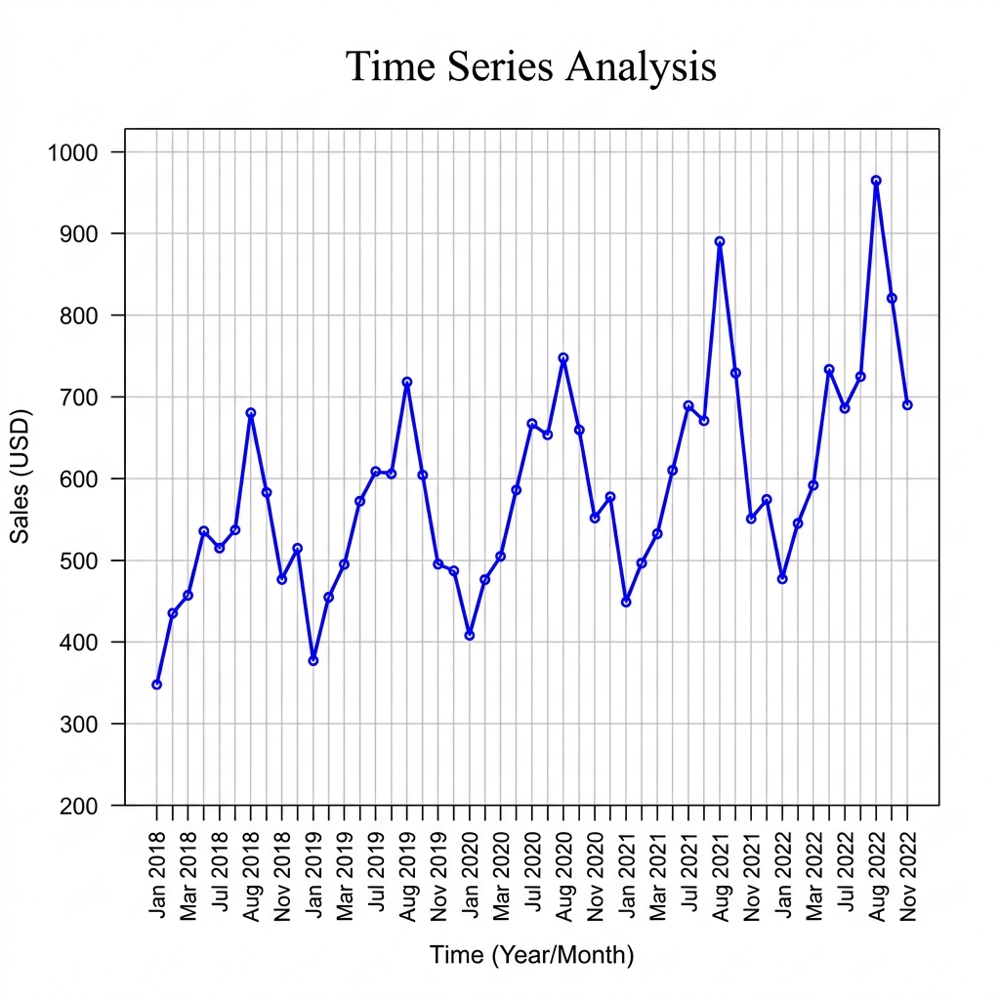

# Exercise 12: Time Series Analysis (R)

### Objective
To implement Time Series Analysis in R by creating a time series object and plotting the data to observe trends and seasonality.

### R Code
```r
# Create raw data (Monthly Sales)
sales_data <- c(350, 440, 460, 530, 520, 540, 680, 590, 480, 510, 380, 450, 
                500, 570, 610, 600, 720, 600, 500, 490, 410, 480, 500, 590)

# Convert to Time Series object (starts Jan 2018, monthly frequency)
sales_ts <- ts(sales_data, start=c(2018, 1), frequency=12)

# Plotting the Time Series
plot(sales_ts, main="Time Series Analysis of Sales", 
     xlab="Time (Year)", ylab="Sales (USD)", col="blue", lwd=2)
grid()
```

### Key Functions
- `ts()`: Converts a vector or matrix into a time-series object.
- `plot()`: Standard R plotting function handles time-series objects automatically.

### Expected Output Plot

