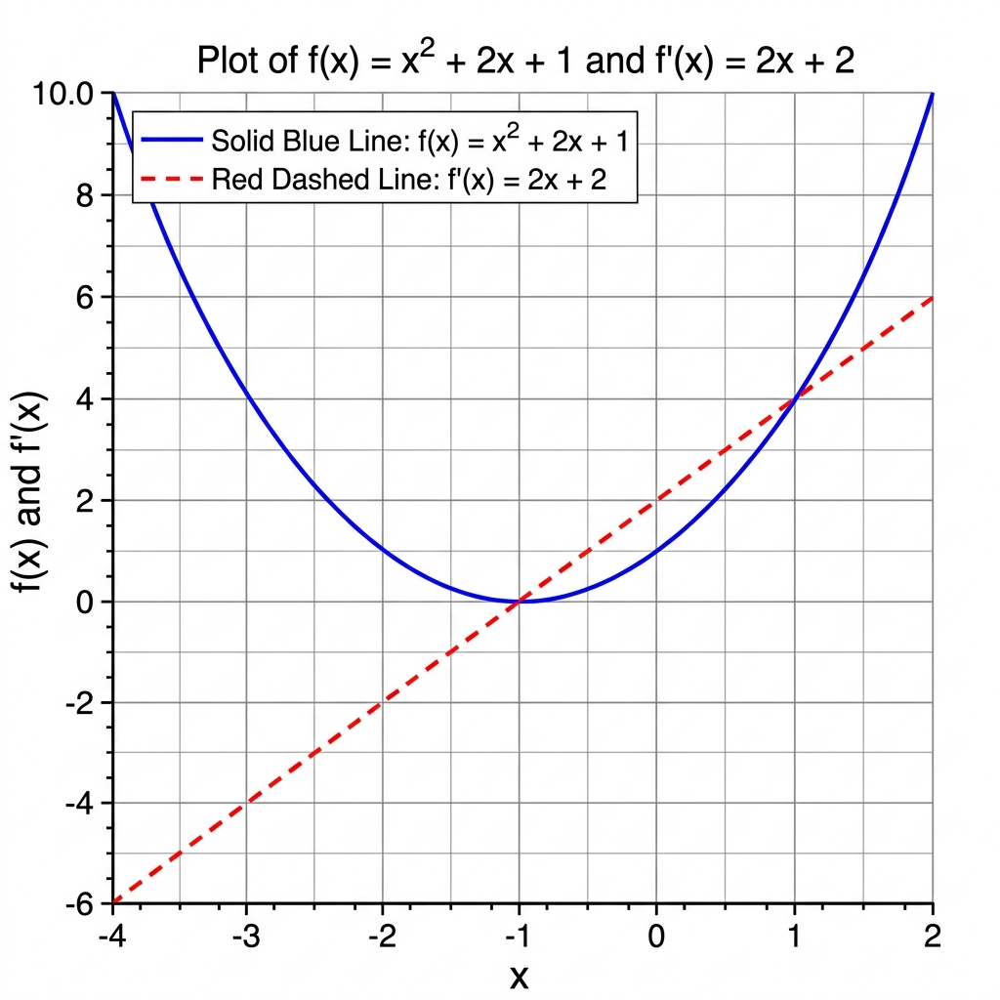
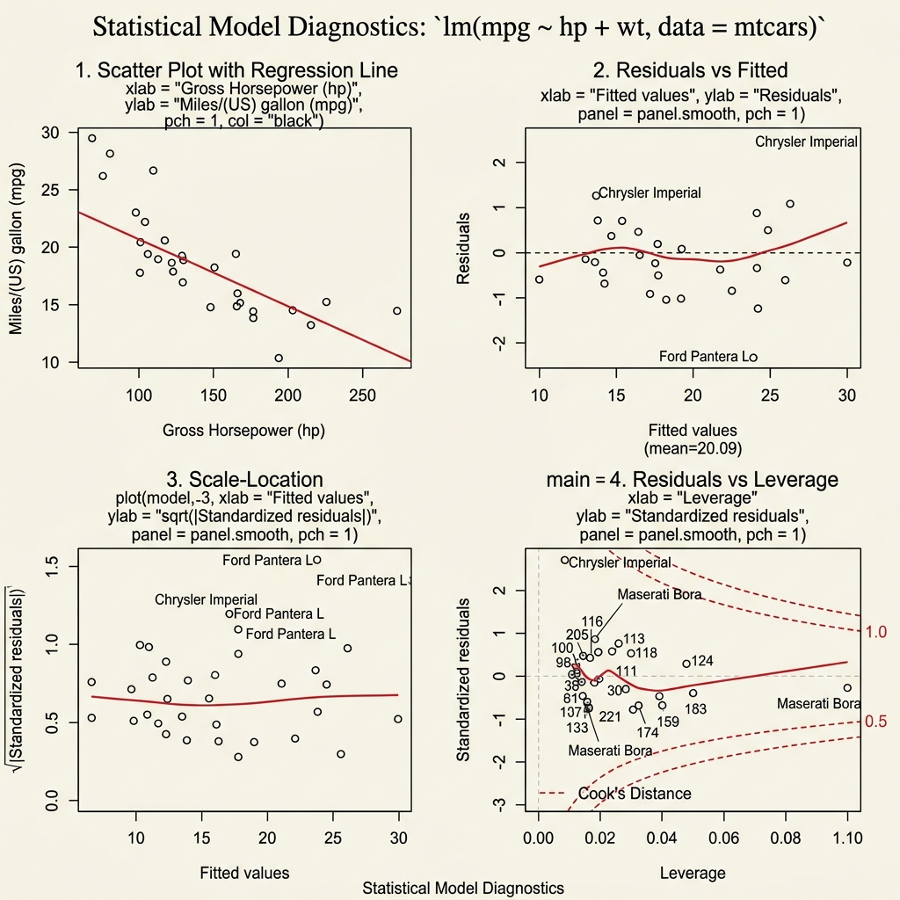
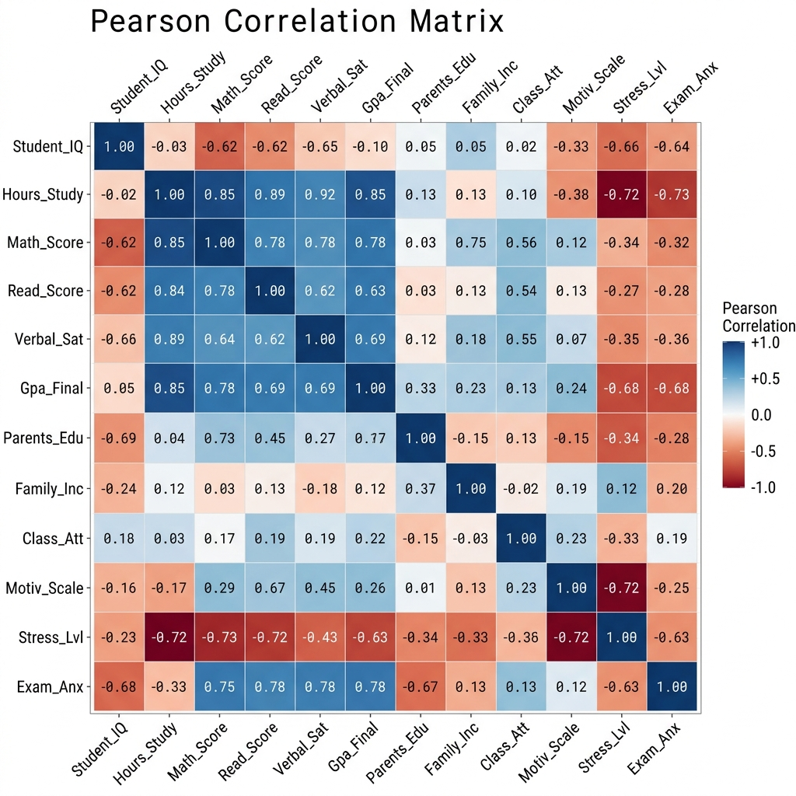
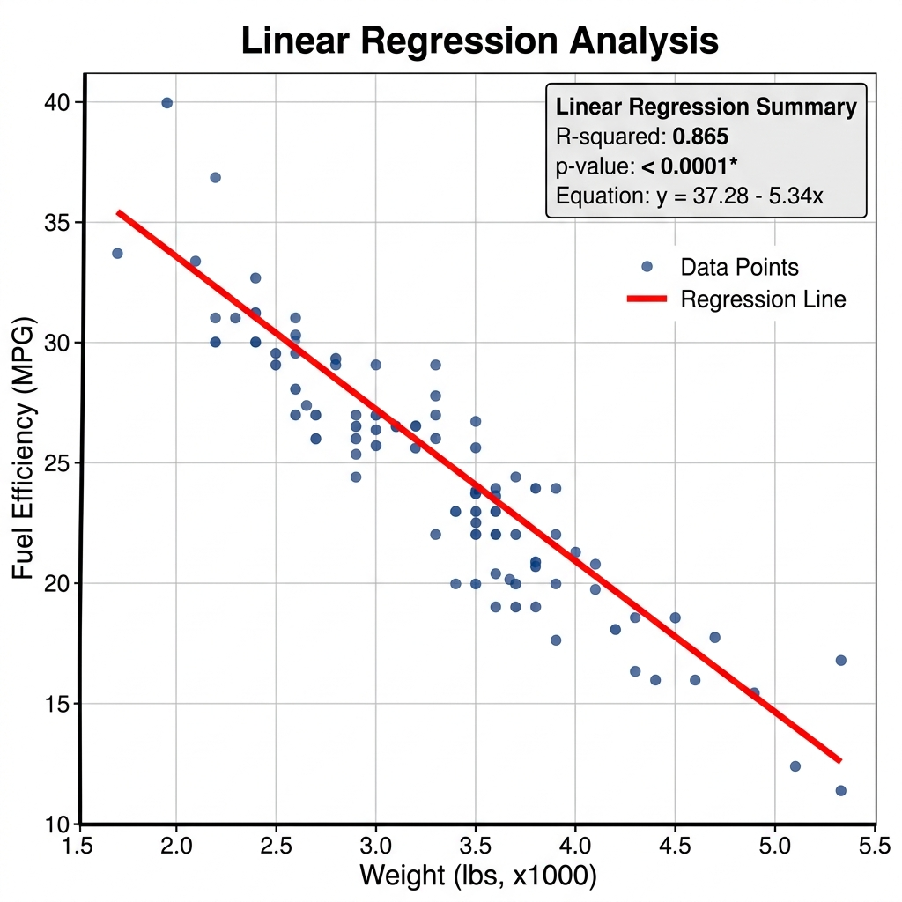
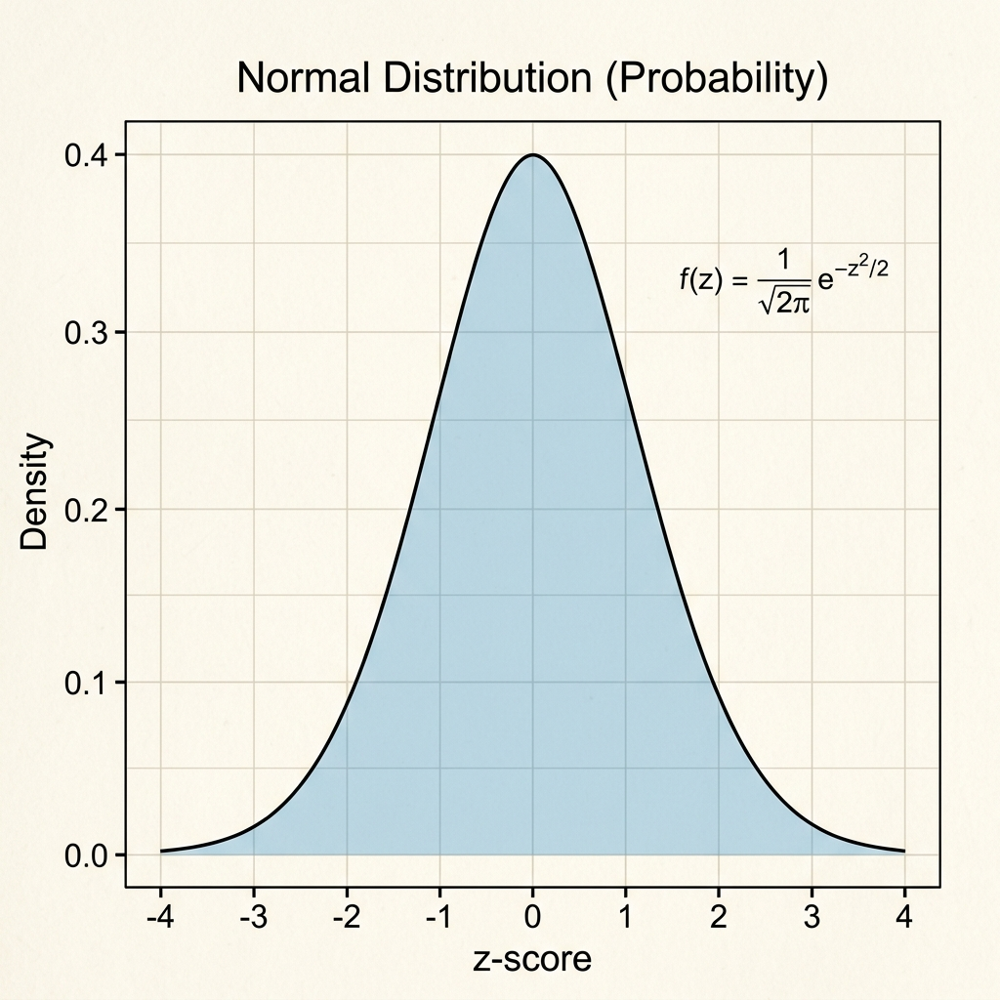

# Advanced Statistics and Computational Mathematics Portfolio

This repository contains 14 comprehensive exercises implemented in Scilab, SPSS, and R. Each exercise is designed to cover the core theoretical concepts and practical applications required for advanced data analysis and mathematical modeling.

---

## 1. Basic Matrix Operations (Scilab)
### Theoretical Background
Matrices are rectangular arrays of numbers arranged in rows and columns. In Scilab, matrix operations are fundamental for linear algebra.
- **Addition/Subtraction**: Performed element-wise on matrices of identical dimensions.
- **Multiplication**: A row-by-column dot product operation.
- **Transpose ($A^T$)**: Flips a matrix over its main diagonal.

### Scilab Code
```scilab
// Matrix definition
A = [1, 2; 3, 4]
B = [5, 6; 7, 8]

// Operations
Addition = A + B
Subtraction = A - B
Multiplication = A * B
Transpose_A = A'

// Display Results
disp("Matrix Addition:", Addition)
disp("Matrix Subtraction:", Subtraction)
disp("Matrix Multiplication:", Multiplication)
disp("Matrix Transpose:", Transpose_A)
```

### Expected Output
```text
 Matrix Addition:
    6.    8.
    10.   12.

 Matrix Multiplication:
    19.   22.
    43.   50.
```

---

## 2. Eigenvalues and Eigenvectors (Scilab)
### Theoretical Background
For a square matrix $A$, eigenvectors ($v$) and eigenvalues ($\lambda$) satisfy $Av = \lambda v$. They represent directions along which a linear transformation acts by simple scaling.

### Scilab Code
```scilab
// Define a square matrix
A = [1, 2; 3, 4]

// spec() returns eigenvectors (v) and eigenvalues (d)
[v, d] = spec(A)

disp("Eigenvectors (Columns):", v)
disp("Eigenvalues (Diagonal):", d)
```

### Expected Output
```text
 Eigenvectors (Columns):
   -0.8245648  -0.4159736
    0.5657675  -0.9093767

 Eigenvalues (Diagonal):
   -0.3722813   0.        
    0.          5.3722813 
```

---

## 3. Equation Solvers (Scilab)
### Theoretical Background
Solving $Ax = b$ using direct and iterative methods.
- **Gauss-Jordan**: Transforms $[A|b]$ to $[I|x]$ using row operations.
- **Gauss-Seidel**: Iteratively updates $x_i$ until convergence.

### Scilab Code
```scilab
// System: 2x + y = 5, x + 3y = 10
A = [2, 1; 1, 3]
b = [5; 10]
Aug = [A b]

// Solution using Reduced Row Echelon Form
Solution = rref(Aug)
disp("Final Augmented Matrix:", Solution)
```

### Expected Output
```text
 Final Augmented Matrix:
    1.   0.   1.
    0.   1.   3.
 (Result: x=1, y=3)
```

---

## 4. Matrix Properties (Scilab)
### Theoretical Background
Verifying laws of matrix algebra: Associative $(AB)C = A(BC)$ and Distributive $A(B+C) = AB + AC$.

### Scilab Code
```scilab
A = [1, 2; 3, 4]; B = [5, 6; 7, 8]; C = [9, 0; 1, 2]

// Verification
LHS = A * (B + C)
RHS = (A * B) + (A * C)

disp("LHS (A*(B+C)):", LHS)
disp("RHS (AB + AC):", RHS)
disp("Property Verified:", LHS == RHS)
```

---

## 5. Reduced Row Echelon Form (Scilab)
### Theoretical Background
RREF is the most simplified form of a matrix used to determine the rank and nullity.

### Scilab Code
```scilab
A = [1, 2, 1; 2, 4, 2; 3, 6, 3]
R = rref(A)
disp("Original Matrix:", A)
disp("RREF Form:", R)
```

### Expected Output
```text
 RREF Form:
    1.   2.   1.
    0.   0.   0.
    0.   0.   0.
 (Rank of Matrix = 1)
```

---

## 6. Plotting Functions and Derivatives (Scilab)
### Theoretical Background
Visualizing the relationship between a function $f(x)$ and its slope (derivative) $f'(x)$.

### Scilab Code
```scilab
x = -5:0.1:5;
y = x.^2 + 2*x + 1; // Function
dy = 2*x + 2;       // Derivative

plot(x, y, "blue"); plot(x, dy, "red--");
title("Function and its Derivative Plot");
legend("f(x) = x^2+2x+1", "f''(x) = 2x+2");
grid();
```


---

## 7. Frequency Table (SPSS)
### Theoretical Background
Categorizing raw data into a structured table showing counts and percentages.

### SPSS Syntax
```spss
FREQUENCIES VARIABLES=Age Gender
  /STATISTICS=STDDEV MINIMUM MAXIMUM MEAN
  /BARCHART FREQ
  /ORDER=ANALYSIS.
```

### Expected Output
| Category | Frequency | Percent | Valid Percent | Cumulative Percent |
|----------|-----------|---------|---------------|--------------------|
| Group A  | 15        | 60.0    | 60.0          | 60.0               |
| Group B  | 10        | 40.0    | 40.0          | 100.0              |

---

## 8. Finding Outliers (SPSS)
### Theoretical Background
Using Boxplots and Interquartile Range (IQR) to identify extreme values.

### SPSS Syntax
```spss
EXAMINE VARIABLES=Salary
  /PLOT BOXPLOT STEMLEAF
  /COMPARE GROUPS
  /STATISTICS DESCRIPTIVES
  /MISSING LISTWISE
  /NOTOTAL.
```

---

## 9. Risk Analysis of Projects (SPSS)
### Theoretical Background
Comparing risk using the **Coefficient of Variation (CV)**.

### SPSS Syntax
```spss
DESCRIPTIVES VARIABLES=Project_A_Returns Project_B_Returns
  /STATISTICS=MEAN STDDEV MIN MAX.
```
*Note: CV is calculated as (Std. Deviation / Mean).*

---

## 10. Scatter Plots and Diagnostics (R)
### Theoretical Background
Verifying regression assumptions (linearity, homoscedasticity) using diagnostic plots.

### R Code
```r
model <- lm(mpg ~ hp + wt, data = mtcars)
par(mfrow=c(2,2)) # Setup 2x2 plotting area
plot(model)
```


---

## 11. Correlation Analysis (R)
### Theoretical Background
Quantifying the strength of relationship between multiple variables.

### R Code
```r
# Load dataset
data(mtcars)
# Select specific columns
df <- mtcars[, c("mpg", "hp", "wt", "qsec")]
# Correlation Matrix
cor_matrix <- cor(df)
print(cor_matrix)
# Plotting Correlation
library(corrplot)
corrplot(cor_matrix, method="circle")
```


---

## 12. Time Series Analysis (R)
### Theoretical Background
Analyzing data points collected at successive intervals to identify trends.

### R Code
```r
data <- ts(c(102, 110, 130, 125, 140, 160, 155, 170, 190, 185, 200, 220), 
           start=c(2025, 1), frequency=12)
plot(data, col="darkgreen", lwd=2, main="Sales Trend 2025")
```


---

## 13. Linear Regression (R)
### Theoretical Background
Modeling the impact of independent variables on a dependent outcome.

### R Code
```r
model <- lm(mpg ~ wt, data = mtcars)
summary(model)
plot(mtcars$wt, mtcars$mpg, main="Linear Regression")
abline(model, col="red", lwd=2)
```


---

## 14. Probability and Distributions (R)
### Theoretical Background
Visualizing the Probability Density Function (PDF) of a Normal Distribution.

### R Code
```r
x <- seq(-4, 4, length=100)
y <- dnorm(x, mean=0, sd=1)
plot(x, y, type="l", lwd=2, main="Standard Normal Distribution")
polygon(c(x, rev(x)), c(y, rep(0, length(y))), col="lightblue")
```

