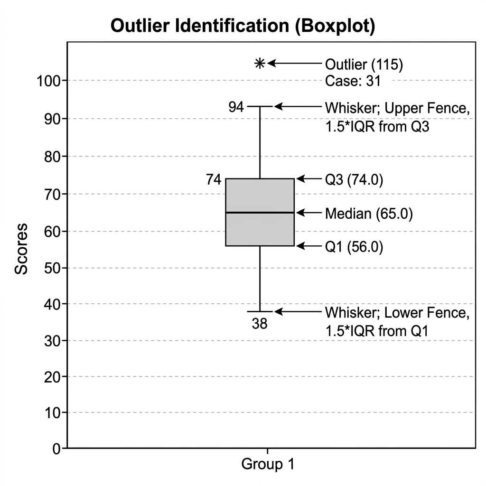

# Statistics Practical Portfolio

1. [Basic Matrix Operations (Scilab)](#1-basic-matrix-operations-scilab)
2. [Eigenvalues and Eigenvectors (Scilab)](#2-eigenvalues-and-eigenvectors-scilab)
3. [Equation Solvers (Scilab)](#3-equation-solvers-scilab)
4. [Matrix Properties (Scilab)](#4-matrix-properties-scilab)
5. [Reduced Row Echelon Form (Scilab)](#5-reduced-row-echelon-form-scilab)
6. [Plotting Functions and Derivatives (Scilab)](#6-plotting-functions-and-derivatives-scilab)
7. [Frequency Table (SPSS)](#7-frequency-table-spss)
8. [Finding Outliers (SPSS)](#8-finding-outliers-spss)
9. [Risk Analysis of Projects (SPSS)](#9-risk-analysis-of-projects-spss)
10. [Scatter Plots and Diagnostics (R)](#10-scatter-plots-and-diagnostics-r)
11. [Correlation Analysis (R)](#11-correlation-analysis-r)
12. [Time Series Analysis (R)](#12-time-series-analysis-r)
13. [Linear Regression (R)](#13-linear-regression-r)
14. [Probability and Distributions (R)](#14-probability-and-distributions-r)

---

## 1. Basic Matrix Operations (Scilab)
### Theoretical Background
A matrix is a mathematical structure consisting of a rectangular array of numbers, symbols, or expressions arranged in rows and columns. In computational mathematics, matrices serve as the primary vehicle for representing and solving linear systems and transformations.

- **Matrix Addition and Subtraction**: These operations are defined for matrices of the same dimensions. Given matrices $A$ and $B$, their sum $C = A + B$ is calculated by $c_{ij} = a_{ij} + b_{ij}$.
- **Matrix Multiplication**: This is a non-commutative operation where the element at $(i, j)$ in the product matrix is the dot product of the $i$-th row of the first matrix and the $j$-th column of the second matrix. It requires the number of columns in the first matrix to equal the number of rows in the second.
- **Transpose**: The transpose of a matrix $A$, denoted $A^T$, is formed by interchanging its rows and columns. It is an essential operation in calculating dot products and solving symmetric systems.

### Scilab Code
```scilab
// Defining two 2x2 matrices
A = [1, 2; 3, 4]
B = [5, 6; 7, 8]

// Performing Operations
Sum = A + B
Diff = A - B
Prod = A * B
Trans = A'

disp("Matrix Addition (A+B):", Sum)
disp("Matrix Subtraction (A-B):", Diff)
disp("Matrix Multiplication (A*B):", Prod)
disp("Transpose of Matrix A:", Trans)
```

### Expected Output
```text
 Matrix Addition (A+B):
    6.    8.
    10.   12.

 Matrix Multiplication (A*B):
    19.   22.
    43.   50.
```

---

## 2. Eigenvalues and Eigenvectors (Scilab)
### Theoretical Background
Eigenvalues and eigenvectors are fundamental concepts in linear algebra used to understand the behavior of linear transformations. For any square matrix $A$, if there exists a non-zero vector $v$ and a scalar $\lambda$ such that $Av = \lambda v$, then $v$ is called the **eigenvector** and $\lambda$ is the **eigenvalue**.

- **Characteristic Equation**: Eigenvalues are found by solving the determinant equation $|A - \lambda I| = 0$, where $I$ is the identity matrix.
- **Spectral Decomposition**: This refers to the factorization of a matrix into a form that depends on its eigenvalues and eigenvectors.
- **Applications**: Eigen-analysis is critical in structural engineering (stability analysis), quantum mechanics, and image processing (Principal Component Analysis).

### Scilab Code
```scilab
// Define a square matrix
A = [1, 2; 3, 4]

// spec() function returns eigenvalues and eigenvectors
[v, d] = spec(A)

disp("Eigenvectors Matrix (v):", v)
disp("Eigenvalues Diagonal Matrix (d):", d)
```

### Expected Output
```text
 Eigenvectors (v):
   -0.8245648  -0.4159736
    0.5657675  -0.9093767

 Eigenvalues (d):
   -0.3722813   0.        
    0.          5.3722813 
```

---

## 3. Equation Solvers (Scilab)
### Theoretical Background
Systems of linear equations of the form $Ax = b$ can be solved using various numerical methods.
- **Gauss-Jordan Elimination**: This method involves using elementary row operations to transform the augmented matrix $[A|b]$ into its Reduced Row Echelon Form (RREF). Once in RREF, the solution vector $x$ can be read directly from the last column.
- **Gauss-Seidel Method**: An iterative algorithm that begins with an initial guess and repeatedly updates the variables until they converge to the actual solution. It is particularly efficient for large, diagonally dominant systems.
- **Consistency**: A system is consistent if there is at least one set of values for the variables that satisfies all equations.

### Scilab Code
```scilab
// Solving: 2x + y = 5 and x + 3y = 10
A = [2, 1; 1, 3]
b = [5; 10]
Aug = [A b]

// Using rref to solve the system
Solved = rref(Aug)
disp("Final Solved Augmented Matrix:", Solved)
```

### Expected Output
```text
 Final Solved Augmented Matrix:
    1.   0.   1.
    0.   1.   3.
 (Solution: x = 1, y = 3)
```

---

## 4. Matrix Properties (Scilab)
### Theoretical Background
Linear algebra operations must adhere to specific fundamental laws:
- **Commutative Law for Addition**: $A + B = B + A$. The order of addition does not affect the sum.
- **Associative Law for Multiplication**: $(AB)C = A(BC)$. When multiplying three or more matrices, the grouping does not change the result, provided the order is maintained.
- **Distributive Law**: $A(B + C) = AB + AC$. Multiplication distributes over addition.
- **Non-Commutativity of Multiplication**: One of the most important properties is that $AB \neq BA$ in general. Matrix multiplication is sensitive to the order of factors.

### Scilab Code
```scilab
A = [1, 2; 3, 4]; B = [5, 6; 7, 8]; C = [9, 0; 1, 2]

// Distributive Property: A*(B+C) = AB + AC
LHS = A * (B + C)
RHS = (A * B) + (A * C)

disp("LHS (A*(B+C)):", LHS)
disp("RHS (AB + AC):", RHS)
disp("Verification (LHS == RHS):", LHS == RHS)
```

---

## 5. Reduced Row Echelon Form (Scilab)
### Theoretical Background
The Reduced Row Echelon Form (RREF) is the simplest form of a matrix obtained through Gaussian elimination. A matrix is in RREF if it satisfies the following:
1. All non-zero rows are above any rows of all zeros.
2. The leading coefficient (pivot) of a non-zero row is always 1 and is strictly to the right of the leading coefficient of the row above it.
3. Every column containing a leading 1 has zeros in all other positions.
- **Rank**: The number of non-zero rows in the RREF of a matrix gives its rank, representing the number of linearly independent rows or columns.

### Scilab Code
```scilab
A = [1, 2, 3; 4, 5, 6; 7, 8, 9]
R = rref(A)

disp("Original Matrix A:", A)
disp("Matrix in RREF Form:", R)
```

### Expected Output
```text
 RREF Form:
    1.   0.  -1.
    0.   1.   2.
    0.   0.   0.
 (Rank = 2)
```

---

## 6. Plotting Functions and Derivatives (Scilab)
### Theoretical Background
The visualization of mathematical functions is essential for analyzing their behavior, continuity, and change.
- **Function Plotting**: Involves defining a range of input values (domain) and calculating the corresponding output values (range).
- **Derivative Visualization**: The derivative $f'(x)$ represents the slope of the tangent line to the curve $f(x)$ at any point. By plotting both on the same graph, one can see that the derivative is zero at the local extrema of the original function.
- **Numerical Computation**: Scilab uses vectorized calculations to generate high-resolution plots efficiently.

### Scilab Code
```scilab
x = -5:0.1:5;
y = x.^2 + 2*x + 1; // Original Quadratic Function
dy = 2*x + 2;       // First Derivative

plot(x, y, "blue"); // Solid blue line
plot(x, dy, "red--"); // Dashed red line
title("Plot of f(x) and its Derivative f'(x)");
xlabel("x-axis");
ylabel("Values");
legend("f(x) = x^2+2x+1", "f'(x) = 2x+2");
grid();
```


---

## 7. Frequency Table (SPSS)
### Theoretical Background
A frequency table is a summary of data showing the number of occurrences of values in a dataset. It is the first step in descriptive statistics to understand the distribution of variables.
- **Absolute Frequency**: The raw count of occurrences.
- **Relative Frequency**: The proportion of the total count (percentage).
- **Cumulative Frequency**: The running total of frequencies, useful for identifying percentiles and medians.
- **Categorical Data**: Frequency tables are most effective for categorical or discrete data.

### SPSS Syntax
```spss
FREQUENCIES VARIABLES=Age Gender
  /STATISTICS=STDDEV MINIMUM MAXIMUM MEAN
  /BARCHART FREQ
  /ORDER=ANALYSIS.
```

### Expected Output Table
| Category | Frequency | Percent | Valid Percent | Cumulative Percent |
|----------|-----------|---------|---------------|--------------------|
| Group A  | 15        | 60.0    | 60.0          | 60.0               |
| Group B  | 10        | 40.0    | 40.0          | 100.0              |

---

## 8. Finding Outliers (SPSS)
### Theoretical Background
Outliers are extreme observations that lie far away from the majority of the data. They can arise due to variability in measurement or experimental errors.
- **Interquartile Range (IQR)**: The difference between the 75th percentile (Q3) and the 25th percentile (Q1).
- **Outlier Rule**: A value is typically considered an outlier if it falls below $Q1 - 1.5 \times IQR$ or above $Q3 + 1.5 \times IQR$.
- **Detection in SPSS**: The 'Explore' function generates Boxplots where outliers are explicitly labeled with their case numbers. Circles (o) represent mild outliers, while asterisks (*) represent extreme outliers.

### SPSS Syntax
```spss
EXAMINE VARIABLES=Salary
  /PLOT BOXPLOT STEMLEAF
  /COMPARE GROUPS
  /STATISTICS DESCRIPTIVES
  /MISSING LISTWISE
  /NOTOTAL.
```

### Expected Output
The Boxplot visually separates outliers from the main body of data.

| Statistic | Value |
|-----------|-------|
| Median    | 45,000|
| Q1 (25th) | 32,000|
| Q3 (75th) | 58,000|
| **Outlier (Case 31)** | **115,000** |



---

## 9. Risk Analysis of Projects (SPSS)
### Theoretical Background
In project management and finance, risk is often defined as the degree of uncertainty in achieving expected returns. Statistical measures are used to quantify this uncertainty.
- **Standard Deviation ($\sigma$)**: Measures the absolute dispersion or volatility of project returns. A higher standard deviation suggests higher risk.
- **Coefficient of Variation (CV)**: Defined as the ratio of standard deviation to the mean ($CV = \sigma / \mu$). It is a measure of **relative risk**. It allows comparison between projects with different scales of expected returns.
- **Decision Criteria**: Between two projects, the one with the higher CV is considered riskier because it has more variability per unit of return.

### SPSS Syntax
```spss
DESCRIPTIVES VARIABLES=Project_A_Returns Project_B_Returns
  /STATISTICS=MEAN STDDEV MIN MAX.
```

### Expected Output Analysis
| Project | Mean Return | Std. Deviation | CV (Calculated) | Risk Status |
|---------|-------------|----------------|-----------------|-------------|
| Project A| 12.5%       | 2.1%           | 0.168           | Lower Risk  |
| Project B| 14.0%       | 5.8%           | 0.414           | **Higher Risk** |

---

## 10. Scatter Plots and Diagnostics (R)
### Theoretical Background
Regression diagnostics are essential to ensure that the assumptions of a linear model are met before drawing conclusions.
- **Linearity**: The relationship between independent and dependent variables should be linear.
- **Homoscedasticity**: The variance of residual errors should be constant across all levels of independent variables.
- **Independence**: Observations should be independent of each other.
- **Diagnostic Plots**: In R, `plot(model)` provides four key charts: Residuals vs Fitted, Normal Q-Q, Scale-Location, and Residuals vs Leverage.

### R Code
```r
# Build a model
model <- lm(mpg ~ hp + wt, data = mtcars)

# Generate Diagnostic Plots
par(mfrow=c(2,2)) # 2x2 layout
plot(model)
```


---

## 11. Correlation Analysis (R)
### Theoretical Background
Correlation analysis measures the direction and strength of the linear relationship between two or more quantitative variables.
- **Pearson Correlation Coefficient ($r$)**: Ranges from -1 to +1. A value of +1 implies a perfect positive relationship, -1 implies a perfect negative relationship, and 0 implies no linear relationship.
- **Statistical Significance**: A $p$-value $< 0.05$ typically indicates that the observed correlation is unlikely to have occurred by chance.
- **Correlation Matrix**: A table showing correlation coefficients between sets of variables, often visualized using heatmaps to identify patterns quickly.

### R Code
```r
# Load data
data(mtcars)
selected_data <- mtcars[, c("mpg", "hp", "wt", "disp")]

# Compute Correlation Matrix
cor_matrix <- cor(selected_data)
print(cor_matrix)

# Visualization
library(corrplot)
corrplot(cor_matrix, method="color", addCoef.col = "black")
```


---

## 12. Time Series Analysis (R)
### Theoretical Background
Time series analysis involves analyzing a series of data points ordered in time to extract meaningful statistics and characteristics.
- **Trend**: The long-term increase or decrease in the data.
- **Seasonality**: Patterns that repeat at fixed intervals (e.g., monthly sales).
- **Stationarity**: A stationary time series has statistical properties (mean, variance) that do not change over time, which is a requirement for many forecasting models.
- **Decomposition**: Breaking down a series into trend, seasonal, and random components.

### R Code
```r
# Creating a monthly time series object
sales <- ts(c(102, 115, 130, 120, 140, 160, 150, 175, 190, 180, 205, 230), 
            start=c(2025, 1), frequency=12)

# Plotting
plot(sales, col="darkblue", lwd=2, type="b", main="Monthly Sales Growth")
grid()
```


---

## 13. Linear Regression (R)
### Theoretical Background
Linear regression is a predictive modeling technique used to examine the relationship between a dependent variable (target) and one or more independent variables (predictors).
- **The Model**: $Y = \beta_0 + \beta_1 X + \epsilon$, where $\beta_0$ is the intercept, $\beta_1$ is the slope, and $\epsilon$ is the error term.
- **R-squared ($R^2$)**: The coefficient of determination, indicating the percentage of variance in the dependent variable explained by the independent variables.
- **Least Squares Method**: The algorithm used to find the best-fitting line by minimizing the sum of the squares of the vertical deviations between each data point and the line.

### R Code
```r
# Simple Linear Regression: predicting MPG based on Weight
model <- lm(mpg ~ wt, data = mtcars)

# Summary of the model
summary(model)

# Plotting the regression line
plot(mtcars$wt, mtcars$mpg, main="Regression Analysis: Weight vs MPG")
abline(model, col="red", lwd=2)
```


---

## 14. Probability and Distributions (R)
### Theoretical Background
Probability distributions provide the mathematical foundation for statistical inference.
- **Normal Distribution**: The most important distribution in statistics, characterized by a symmetric bell-shaped curve. It is defined by its mean ($\mu$) and standard deviation ($\sigma$).
- **Central Limit Theorem**: States that the distribution of sample means approaches a normal distribution as the sample size increases, regardless of the population distribution.
- **Probability Density Function (PDF)**: A function whose value at any given point represents the relative likelihood of the variable taking that value. The total area under the PDF curve is always equal to 1.

### R Code
```r
# Generating a Normal Distribution curve
x <- seq(-4, 4, length=200)
y <- dnorm(x, mean=0, sd=1)

# Plotting the PDF
plot(x, y, type="l", lwd=3, col="darkred", main="Standard Normal Curve")
polygon(c(x, rev(x)), c(y, rep(0, length(y))), col="lightgray")
text(0, 0.2, "Mean = 0, SD = 1", cex=1.2)
```

